# Overview #

This is a re-hosting of the [MilSym Codeplex project](http://milsym.codeplex.com).
The project is no longer under active development but there are some additions and updates:

1. A new WPF map example was added, based on the Fischer [XAML-Map-Control](https://github.com/ClemensFischer/XAML-Map-Control).
2. A new UWP map example was added, based on the Fischer [XAML-Map-Control](https://github.com/ClemensFischer/XAML-Map-Control).
3. A new UWP map example was added, based on Windows.UI.Xaml.Controls.Maps.MapControl.
4. The Esri ArcGIS Client WPF map control was updated to version 10.2.5.
5. The Bing WPF map control was updated to version 1.0.1.

For those seeking to utilize open source military symbology projects supported by the US military, the projects at 
[Mission Command](https://github.com/missioncommand) are active and recommended.

Only the WPF and UWP portions of this project are relevant as Microsoft no longer supports Silveright in Visual Studio.
The entire project can be built under Windows using the <pre>build.bat</pre> file at the root level 
assuming that the *devenv* application is in the path. 
Otherwise the solution files at the root level
can be built in the same order as in the batch file.

For those interested in symbology in general, the [NATO Symbology Wikipedia
article](https://en.wikipedia.org/wiki/NATO_Joint_Military_Symbology) is a good
introduction to the military symbology defined by [MIL-STD
2525C](media/2525C.zip).

MilSym provides XAML-based, Bing-, Fischer- and Esri-compatible map
symbology for units, equipment, installations, tactical graphics,
weather, oceanography, signals intelligence, stability ops and emergency
management.

UWP vs WPF vs Silverlight dependencies have been isolated to specific XAML files and C#<code>#if</code>statements. 
The GraphicsTest and its associated Resource Dictionaries 
(that exercise all single point symbology) works for both WPF and UWP.
The WPF and UWP example map programs display sample single- and multi-point symbols.

The code was written in C\# for WPF .NET 4.x, Silverlight 4.x and Windows 10 Fall Creator's Edition UWP.

The symbology code consists primarily of XAML files with some support code.
The workhorse for point symbology is a Resource Dictionary of
Control Templates representing base
symbols. A symbol code specifies a control template that is then
rendered using either default or user-specified brushes for fills and
outlines. The resulting symbol is then overlaid with label, echelon,
mobility and other symbol decoration. The result is returned as a
MilSymbol object whose base class is Canvas. The interesting symbology
parameters are exposed as dependency properties.

The official 2525C symbology appendices and their status in this project are:

  Appendix | Description                                                     |  Status
  ---------|---------------------------------------------------------------- |------------------------------------------------
  A        | C2 Symbology for Units, Equipment, and Installations            |  Complete
  B        | C2 Symbology for Military Operations                            |  Point symbology and some multi-point symbology
  C        | Meteorological and Oceanographic Symbology                      |  Point symbology only
  D        | Signals Intelligence Symbology                                  |  Complete
  E        | Stability Operations Symbology                                  |  Complete
  F        | Use of Warfighting Symbols in Pseudo-Three-Dimensional Displays |  Not applicable
  G        | Emergency Management Symbols                                    |  Complete

Appendices A, B, and D cover symbology that has primary applicability to military operations.
The symbols in appendices C, E, and G have broader applicability.

Appendix F simply describes different ways to use or display symbols in
a 2.5D or 3D display. In the case of Silverlight, adding a skew
transformation to a symbol for a 2.5D display is straightforward. Only
the scale and rotate transforms are exposed in the MilSymbol interface
for this release. The various MapTest applications, as shown in Figure 5,
demonstrate the use of a translate transform.

**Updates Compared to the Codeplex Version**

***Changes to Support Universal Windows (UWP)***

1.	UWP blows up when using a <i>really small font size</i> to the point where it can crash Windows when debugging in Visual Studio. The MilSymbol and MilGraphic symbology classes protect against this situation by binding to each TextBlock’s Visibility using a TextVisibility property. Visibility is then set to <i>Collapsed</i> when a map draws a symbol using a really small font size.
2.	Almost all UWP classes are in different DLLs compared to their WPF and Silverlight counterparts.  The most common change was replacing <code>System.Windows</code> classes with <code>Windows.UI.Xaml</code> classes.
3.	UWP does not support the use of <code>Line</code> in the following syntax (throws a runtime error):        
    ```C# 
    Style="{Binding Line}" 
    ```
    Maybe the word <code>Line</code> is now reserved? Changing the bound property name to <code>Lines</code> fixed this problem. Other bound terms such as <code>Fill</code> and <code>LineFill</code> did not have this problem.
4.	UWP resources are addressed differently, requiring an absolute Uri. For example,
    ```C#
    "/MilSym.AppendixA.WPF;component/AirSpaceAppendixA.xaml"    // WPF example
    "ms-appx:///MilSym.AppendixA.UWP/AirSpaceAppendixA.xaml"    // UWP example
    ```
5.	A Canvas can no longer be clipped to an ellipse geometry - the lone instance was replaced with properly computed clipped points.
6.	UWP cannot "get" a non-existent ControlTemplate (throws an exception) so requested templates are now checked for existence.
7.	Minor changes were required in property values such as:
    * (various)<code>Transform.Transform</code> => (various)<code>Transform.TransformPoint</code>
    * <code>ScrollViewer.ScrollToVerticalOffset</code> => <code>ScrollViewer.ChangeView</code>
    * <code>Application.Current.MainWindow</code> => <code>Window.Current.Content</code>
    * <code>new Binding(prop)</code> => <code>new Binding() { Path = new PropertyPath(prop) }</code>
    * <code>XamlReader.Parse</code> => <code>XamlReader.Load</code>
    * <code>(IList)TextBlock.Inlines</code> => <code>(InlineCollection)TextBlock.Inlines</code>
    * <code>ToUpper(CultureInfo.InvariantCulture)</code> => <code>ToUpperInvariant()</code>
8.	The UWP Bing map does not scale map tiles according to a web Mercator projection. Therefore, MilGraphic objects are no longer properly scaled. This might be fixable but the high refresh latency makes the usefulness questionable.

***Esri ArcGISRuntime 10.2.5***

1.	Location’s Latitude and Longitude are now readonly.
2.	Moved to OpenStreetMapLayer, replacing Bing map layer.

***Bing’s UWP Map***

1.	XAML symbology objects were enclosed in Borders to render them properly. A MapParent property was added to the MilGraphic and MapMilSymbol objects to maintain a reference to the Border object.

**Some Simple Map Examples**

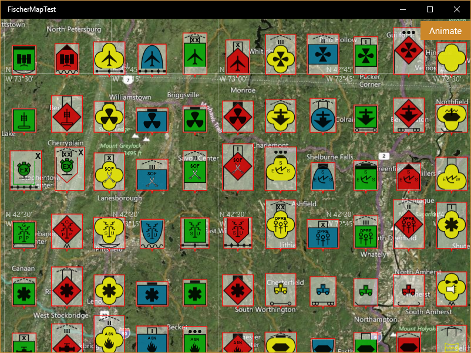\
*Figure 1: Sample output from FischerMapTest shows single-point symbols in
bounding boxes.*

In Figure 1, the base of each bounding box remains located at the user-specified point as
the map zooms and the symbol resizes. The example includes commented out code to add labels. The bounding box automatically exapnds to encompass the labels. All test map programs use the same C# rendering codebase, the TestMapDrawing class. Most of the common symbology code is located in the Silverlight directory and linked to the various projects.\
\
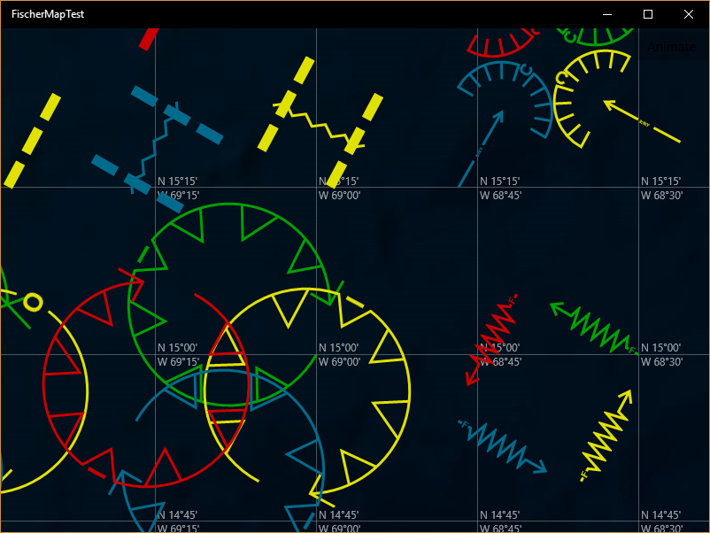\
*Figure 2a: Zoomed map output showing two- and three-point symbololgy.*

In Figure 2a, the map shows a subset of the supported symbols that require a fixed number of anchor points. Sometimes these values represent points and sometimes they represent points and measures such as radii or lengths. The PlotSymbol method in the TestMapDrawing class has code commented out code that draws the base vectors that define these symbols. This is useful to verify that the symbols are being drawn correctly relative to their defining points. 

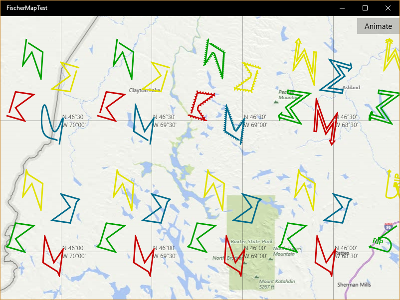\
*Figure 2b: Sample output showing multi-point symbols with Bing road map background.*

In Figure 2b, the map shows a subset of the supported symbols that use multiple points to define polylines or polygons. The PlotSymbol method in the TestMapDrawing class has code commented out code that draws the base vectors that define these symbols.

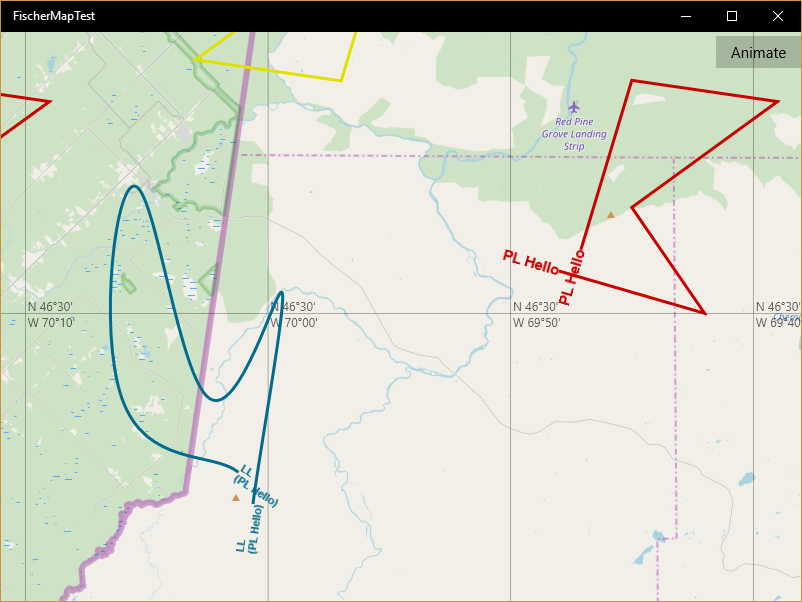\
*Figure 2c: Zoomed in tactical graphics showing the presence of text elements when zoomed in past a certain point with OpenStreetMap background. The spline flag is set on one graphic.*

In Figure 2c, the map shows a zoomed section of the available multi-point symbology. One graphic illustrates using the isSpline property in the MilGraphic class.

**Point Symbology Service**

MiSym includes a third-party contribution for a PNG-based military symbology generator. The project is called MilSymService and is part of the MilSym solution. After building the project, there will be both an install.cmd and a uninstall.cmd file in the same directory as the MilSymService.exe file. To start the service running, run as administrator and execute the install.cmd file. By default the project will install using port number 8765 and will be called “milsym.” 

There is no unit test for this service. To test the service, start it and enter a URL in your browser such as http://localhost:8765/milsym/SJAPMFRZ--MS***?scale=0.20.

Other URL options include:

 * fillColor: can set symbol fill color as an HTML5 color name or as a hex string - e.g., Orange or 0xff00ff.
 * lineColor: can set symbol outline color as an HTML5 color name or as a hex string.
 * opacity: from 0.0 to 1.0 (opaque)
 * colorScheme: dark, medium, or light
 * labeString: list of label names and values. Use commas to separate label/value pairs and colons to separate labels from values but other separators are acceptable as long as they are consistent within the string.

For example, http://localhost:8765/milsym/SUPPS-----*****?scale=0.13&lineColor=Orange&fillColor=0xff00ff&opacity=0.95&colorScheme=dark&labelstring=H:Hello_World,W:Goodbye

 
To debug the service, set a breakpoint in the HandleRequests method in Services.cs and attach the debugger to the Military Symbol Service. The core code (in MilSymBitmap.cs) can also be used to support IIS.

**Summary Status**

The Fischer and UWP Bing map work were the last to be completed. Initial ports to Silverlight, WPF and UWP
are complete. There are some abstractions to preserve a common code base. For example,
ILocation, ILocationCollection, ILocationRect, and
IMilSymLayer. A single factory with support for these types is injected.

The original ESRI map work was limited to WKIDs 102113 and 102100. Otherwise the
generated tactical graphics didn\'t register properly witth their
underlying vector definitions. For example, WKID 4326 compresses the
latitude coordinate differently than WKID 102113. Support for other
coordinate systems would require some abstraction of the coordinate
mapping. The current technique of using ScaleTransform to properly size
the results also limits potential coordinate mappings.

The Fischer map work is complete for both WPF and UWP.

The Bing UWP map work is incomplete as that map uses a different (unexposed) definition for the actual zoom factor. It should be possible to dynamically compute the actual zoom factor for each latitude and each claimed zoom factor and apply that factor in MilGraphic's CanvasLayoutUpdated method.

Multi-point symbology work is incomplete. The latest drop includes some
work on two-, three- and multi-point symbols (arrows, zones, lines) from
Appendix B. The original plan was to finish Appendix B\'s multi-point
items, then Appendix C\'s multi-point items, then interactivity. Other
possible improvements would have included dynamic loading of resources to reduce memory
footprint.

**Miscellaneous**
MilSym computes content bounds for many single-point
symbols to support their precise placement on the map.\
\
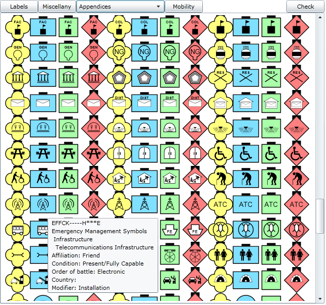\
*Figure 3: Sample output from Appendix G as displayed by the GraphicsTest
project*\

Although less, relevant, this project also supports the generation of the 
files necessary to support Microsoft's Silverlight Pivot Viewer. A JavaScript
version of this program is now available at https://seajax.github.io.

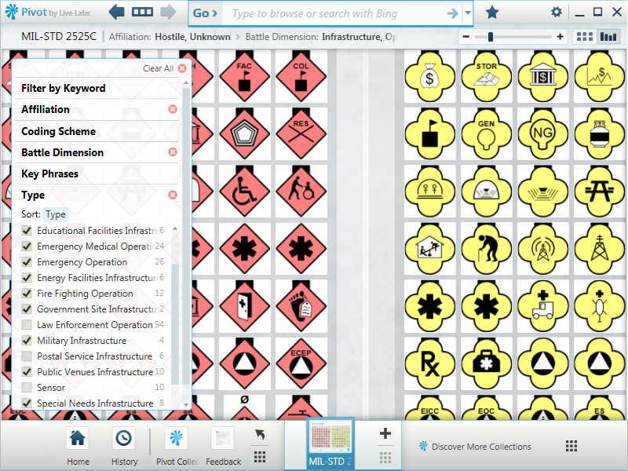\
*Figure 4: Sample output from PivotTest after PAuthor is used on generated
CXML file*

# API Documentation #

Resummarizing, this is the last of several plannned military symbology code drops
corresponding to the various appendices in the [MIL-STD 2525C
standard](media/2525C.zip). For
those interested in symbology in general, the [APP-6A Wikipedia
article](http://en.wikipedia.org/wiki/APP-6a) is a good introduction to
military symbology.\
\
The original Silverlight code in this C\# project now works in WPF and UWP.
Most C# differences are managed through #if's.
XAML dependencies have been isolated to specific files.\
\
This code drop covers Appendices A, B, C, D, E and G.

**Notes**

1.  The error handling in this version is incomplete. Most error
    handling is silent (or not present).
2.  The unit tests are incomplete.

**How Does It Work?**

The workhorse of this application is a ResourceDictionary of
ControlTemplates representing base
symbols. A symbol code specifies a control template that is then
rendered using either default or user-specified brushes for fills and
outlines. The resulting symbol is then overlaid with label, echelon,
mobility and other symbol decoration. The result is returned as a
MilSymbol object whose base class is Canvas. The interesting symbology
parameters are exposed as dependency properties.

## The Classes

**MilSymbol**

The main class, MilSymbol, is in MilSymbol.cs. The sample test programs
illustrate three different ways to create a military symbol:

1. Calling a constructor with arguments &mdash; as in GraphicsTest. All
arguments, except for symbolCode, are optional
```C#
var ms = new MilSymbol(symbolCode, scale: scale, labelString:
labelString, lineBrush: lineBrush, fillBrush: fillBrush, labelStyle:
labelStyle);
```
2\. Setting properties individually &mdash; also in GraphicsTest, for example
```C#
var ms = new MilSymbol
{
    SymbolCode = symbolCode,
    Scale = scale,
    LabelString = labelString,
    LabelG = labelG,
    LineBrush = lineBrush,
    FillBrush = fillBrush,
    LabelStyle = labelStyle
};
```
3\. Binding through XAML &mdash; as shown in BindingTest, for example
```XML
<DataTemplate x:Key="SymbolItemTemplate">
    <MilSym:MilSymbol
        ToolTipService.ToolTip="{Binding Name}"
        SymbolCode="{Binding SymbolCode}"
        Angle="{Binding AngleDegrees}"
        Canvas.Top="{Binding Position.Y}"
        Canvas.Left="{Binding Position.X}"
        LabelH="{Binding AngleDegrees,Converter={StaticResource DoubleConverter}}"
        Scale="0.14"
    \>
</DataTemplate>
```
The important MilSymbol properties are:

-   SymbolCode &mdash; the 15 character symbol code defined by MIL-STD 2525C.
    The symbol code is very complex and should be developed in
    accordance with the standards document. If the symbol code is not
    recognized, the MilSymbol will return an empty canvas. The Boolean
    property, Empty, denotes this state.

<!-- -->

-   LabelString &mdash; a string representing the concatenated labels for the
    military symbol. For example, \"C=23;T=Some Comment;M=Hello
    World;Q=34;V=\". Any non-alphanumeric character can be used for the
    separators \'=\' and \';\' including the same character for each.
    The example above includes five fields, C, T, M, Q and V. Add new
    labels or change old label values by setting LabelString to a new
    value. In the example, label V is cleared. By default there are no
    labels for a symbol.

<!-- -->

-   FillBrush &mdash; the brush to be used to fill the background of the
    symbol. In the event that this value is null or not set, the default
    brush for the current color scheme for that symbol code will be
    used.

<!-- -->

-   LineBrush &mdash; the brush to be used to outline the symbol. In the
    event that this value is null or not set, the default brush for the
    current color scheme for that symbol code will be used.

<!-- -->

-   Scale &mdash; the size of the symbol relative to its default size of
    roughly 300×300 pixels. Good map values are typically in the range
    from 0.1 to 0.2. The default scale of 1.0 is quite large.

<!-- -->

-   Angle &mdash; the angle at which the symbol is to be rendered, measured
    in degrees clockwise from map north. The standard requires that
    symbols be displayed upright except in certain cases but this is NOT
    enforced in the code.

<!-- -->

-   Bounds &mdash; a readonly Rect that bounds the symbol and all of its
    decorations (including labels). The class MapMilSymbol in the
    MapTest sample application shows how to take this information and
    enclose a symbol in a polygon that points to that symbol\'s map
    location. As the map is resized the symbol and its containing
    polygon are also resized even as the polygon continues to point to
    the symbol\'s location. This example illustrates: adding another
    child (the enclosing polygon) element to the returned MilSymbol\'s
    children collection, setting a translate transform to move the
    symbol to the correct location within the polygon, and responding to
    the LayoutUpdated event to ensure that the symbol gets smaller as
    the user zooms out (using an arbitrary power law). Support for
    Bounds is incomplete as not all symbols (mostly those in Appendices
    B and C) compute the correct bounds.

<!-- -->

-   LabelStyle &mdash; the Style to be used for external labels. Only the
    Foreground, FontFamily, FontSize, and FontWeight properties are
    relevant. Setting this value to null restores the default styles as
    listed in the LabelResources.xaml file. The default font is Arial
    which is a proportional font. Font sizes up to about 96px will yield
    reasonable results. These styles are cached so it is a good idea to
    reuse styles where possible.

<!-- -->

-   Label{\[A-Z,AA-AZ\]} &mdash; the individual labels for a military symbol.
    In the following table the unsupported labels are in italics. Some
    values also support Appendix B's multi-point symbols.
    Some labels have mutliple values such as W and W1, used to denote a
    date range. This is most common in Appendix B.

Table 1 Supported and *non-supported* labels

  |Label | Description |
  |------------|--------------------------------------------------------------------|
  LabelC      | Quantity
  LabelF      | +=\>reinforced, -=\>reduced, ±=\>reinforced & reduced
  LabelG      | staff comments
  LabelH      | additional informmation
  LabelJ      | evaluation (reliability plus credibility)
  LabelK      | combat effectiveness
  LabelL      | signature equipment (! indicates detectable electronic signatures)
  LabelM      | number/title of higher command, Roman numerals designate corps
  LabelN      | enemy (ENY) for equipment
  LabelP      | IFF/SIF indentification modes and codes
  LabelQ      | degrees measured clockwise from true north
  *LabelR2*   | *SIGINT mobility (M=\>mobile, S=\>static, U=\>uncertain)*
  LabelT      | unique designation (acquisition nummber when used in SIGINT)
  LabelV      | equipment type
  LabelW      | date/time as DDHHMMSSZMONYYYY or O/O
  LabelX      | altitude or depth
  LabelY      | location (DMS, UTM, or MGRS)
  LabelZ      | Speed
  LabelAA     | name of special C2 headquarters
  *LabelAD*   | *platform type (ELNOT or CENOT)*
  *LabelAE*   | *equipment teardown time*
  *LabelAF*   | *common identifier (e.g., Hawk for Hawk SAM)*
  *LabelAG*   | *auxillary equipment indicator*
  *LabelAM*   | *distance*
  *LabelAN*   | *azimuth*
  *LabelAO*   | *engagement bar*

 

**MilGraphic**

MilGraphic is based on Canvas and places
multi-point tactical graphics on a map.\
\
An alternative, hybrid MilGraphic class of text and \"map polylines\"
was also successfully implemented but its drawbacks outweighed its
features. For example, multiple map objects (lines and text) must then
be generated to support a single symbol code. and the MilGraphic class
must then support a method to add these objects to the map on behalf of
the user - a variance from the preferred interface contract.\
\
Currently, adding a MilGraphic to a BingMap object might look like this:
```C#
var ml = this.milsymFactory.MilSymLayer();
BingMap.Children.Add(ml);
var pg = new MilGraphic { SymbolCode = sc, Anchors = lc };
ml.AddSymbol(pg); 
```
<code>pg.Add(ml)</code> would have been required if a hybrid class had been adopted.

The Anchors establish the position for the graphic. Placing the graphic
someplace else by calling the AddChild method of a MapLayer (with a
position) will result in an incorrectly behaving graphic. The
UpdateLayout event is processed whenever the map is zoomed to ensure
that the correct scale factor is applied to the graphic. This approach
depends on the fact that updating a simple scale transform is sufficient
to maintain the correct appearance (location) of the graphic at varying
zoom levels.\
\
A different mapping system might require a more complex transformation
as will moving the graphic across the landscape (which will be supported
through binding the Anchor collection).\
\
In the current MilGraphic class, a ControlTemplate is transformed
according to the user-supplied Anchor points. An artifact of the
original approach to the transform was that line widths did not scale
evenly in all directions. So all geometries were converted to
PathGeometries to eliminate the line width scaling issue. However future
changes may be required to reduce rendering artifacts on text or other
graphics primitives. The proper scaling of line widths remains under
investigation.\
\
As previously mentioned, the MilGraphic class scales properly, and
smoothly, when zooming. The setup matrix and map transformation
computations to get to this point remain messy.\
\
The standard often uses the third specified point in a tactical graphic
to set a length rather than to set an exact point. The code has been
modified to use projected lengths in many places.\
\
As described above, the MilGraphic user interface is quite simple (also
uses optional arguments):\
```C#
var ms = new MilGraphic
{
    SymbolCode = symbolCode,
    Anchors = anchors
};
```
The important MilGraphic properties are:

-   SymbolCode &mdash; the 15 character symbol code defined by MIL-STD 2525C.
    The symbol code is very complex and should be developed in
    accordance with the standards document. If the symbol code is not
    recognized, the MilGraphic will return an empty canvas. The
    Boolean property, Empty, denotes this state.

<!-- -->

-   Anchors &mdash; an array of Locations representing the points specified
    by MIL-STD 2525C to anchor the given graphic. Currently only some
    two and three point graphics are supported. Currently there is no
    support for MGRS or DMS coordinate input - only abstracted
    collections of WGS-84 decimal latitudes and longitudes.

Two point objects (there are many in Appendix B) are generally simpler
than these three point objects. Deciding on proportionality remains an
issue. For example, should a long arrow have a bigger head than a short
arrow drawn at the same zoom level? The current approach is to scale the
entire two point object proportionally.\
\
Many multi-point objects (e.g., weather fronts) are really just complex
line styles. The rendering approach includes a hybrid of templates and
code. *Axis of advance* is a good example.

**MilBrush**

The MilBrush class provides access to pre-defined static solid color
Brushes as specified by MIL-STD 2525C. These are useful for filling
symbol backgrounds.\
\
MilBrush supports the ColorScheme property. ColorSchemeProperty supports
an enumerated set of color schemes &mdash; Dark, Medium and Light. Once set,
new symbols are drawn using that color scheme. The default color scheme
is Light.\
\
Table 2 ColorSchemes with matching brush names

  Color Scheme | Available Brush Names
  ------------------- |----------------------------------------------------------------
  Dark             |   DarkYellow, DarkPurple, DarkGreen, DarkRed, DarkBlue
  Medium           |   MediumYellow, MediumPurple, MediumGreen, MediumRed, MediumBlue
  Light            |   LightYellow, LightPurple, LightGreen, LightRed, LightBlue

 

**Symbol Code Descriptions**

The symbol code descriptions are static methods that return
user-friendly descriptions based on the symbol code.\
\
Table 3 Methods that support user-friendly descriptions of military
symbol codes

  Class.Method(string symbolCode)  | Returns
  --------------------------------------|----------------------------------------------------------
  MilAppendix.Description              |  Nested description of core symbol
  StandardIdentity.GetName             |  Standard identity and exercise amplifying descriptor
  StatusOperationalCapacity.GetName    |  Status/operational capacity
  OrderOfBattle.GetName                |  The order of battle
  Countries.GetName                    |  The name of the country
  CombinedModifierCode.GetName         |  Mobility, echelon, headquarters, feint dummy, task force
  CodingScheme.GetName                 |  The coding scheme


### The Test Programs

**GraphicsTest**

This is the most comprehensive visual test. It runs through many of the
code paths and generates four basic charts. Some versions of the program can compute a
chart image checksum and compare it against future chart image
checksums, but currently there is no initial checksum. The Check button
computes the checksum and does the comparison. This and the maps are currently the
only tests that run in UWP, WPF and Silverlight.

-   GraphicsTest opens with a simple example of a single rotating
    military symbol that changes its symbol code periodically. It also
    displays its current angle. Click on any of the chart buttons to
    terminate this test.

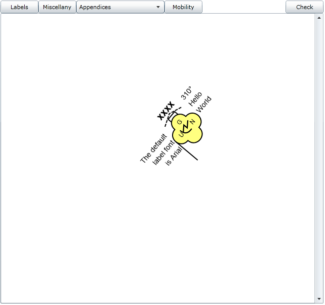\
*Figure 5: Rotating military symbol illustrating one dynamic label*

-   The Labels button exercises all of the currently supported labels.
    The test uses the Arial and Times New Roman fonts. The symbol arrows
    correspond to a Q field numeric value. Because Silverlight supports
    very feature rich tooltips, the need for a symbol to display more
    than a cursory amount of data is diminished.

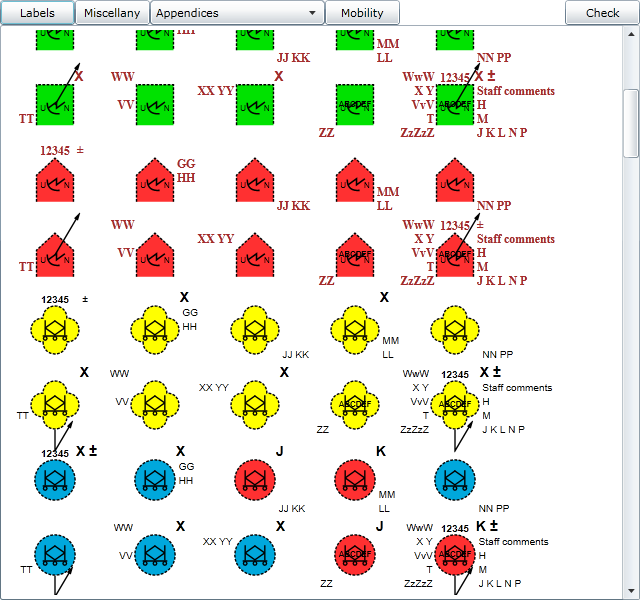\
*Figure 6: Sample symbols illustrating label positions*

-   The Miscellaneous button draws a variety of symbols including
    various brushes for the interiors and edges of the symbols. Various
    echelon markings are also displayed.

  Column | Description |
  ------------- |--------------------------------------------------------------
  1        |     A custom "linear blend" fill brush with a custom outline color
  2        |     The Dark ColorScheme
  3        |     The Medium ColorScheme with a custom outline color
  4        |     The Light ColorScheme which is also the default
  5        |     The Damaged symbol overlay
  6        |     The Destroyed symbol overlay
  7        |     The Unknown battle dimension
  8        |     The Civilian order of battle for an Unknown battle dimension. The standard calls for the use of purple on civilian order of battle objects with the exception of the hostile or suspect standard identities

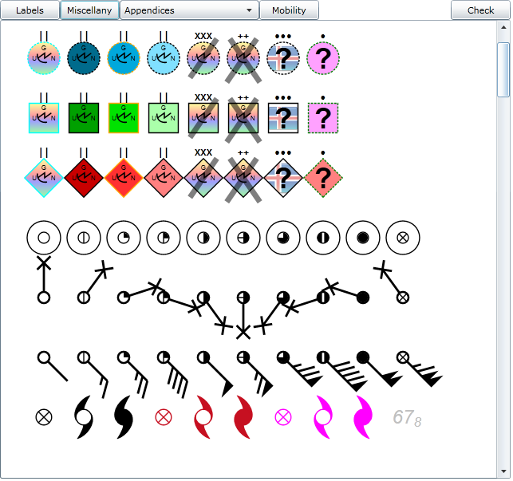\
*Figure 7: A collection of miscellaneous symbol properties*

-   The Appendices combo box supports rendering all of the base symbols
    in the available appendix resource dictionaries. There are gaps
    because the standard has some symbol codes that lack any
    representation. The symbols are arranged in a hierarchy and the
    parent nodes of some hierarchies lack any generic symbol. The black
    band across the top of some symbols indicates that the symbol is for
    Space. The same symbol without the black band is for Air. These
    symbols are drawn in the same order as they are in their respective
    MIL-STD 2525C appendices.


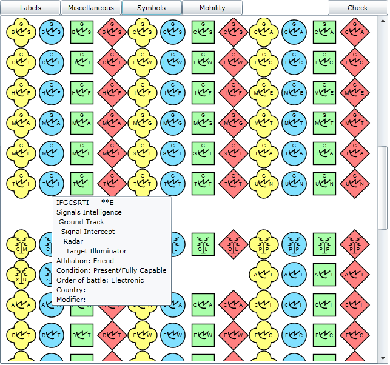\
*Figure 8: Some symbols in Appendix D*\
\
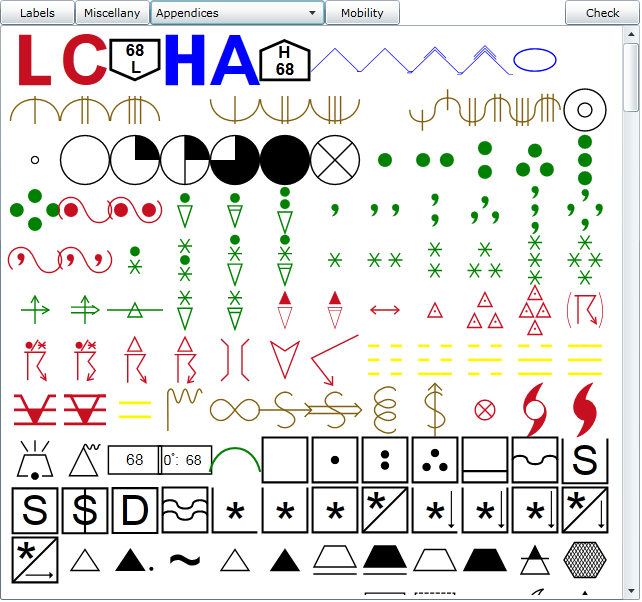\
*Figure 9: Some symbols in Appendix C*\
\
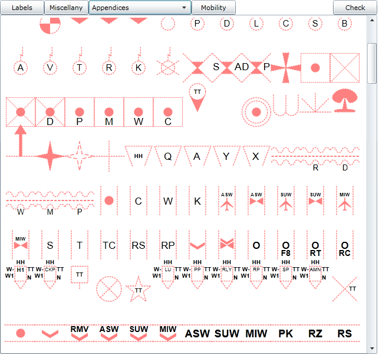\
*Figure 10: Some symbols in Appendix B*

-   The Mobility button illustrates the use of Modifier codes
 

  Row  | Column | Description
  ----------| ------------- |--------------------------------------------------------
  1        |  1          |   Wheeled (Limited Cross-country)
  1        |  2          |   Wheeled (Cross-country)
  1        |  3          |   Tracked
  1        |  4          |   Wheeled & Tracked Combination
  1        |  5          |   Towed
  1        |  6          |   Railway
  1        |  7          |   Over-Snow (Prime Mover)
  1        |  8          |   Sled
  1        |  9          |   Pack Animals
  1        |  10         |   Barge
  1        |  11         |   Amphibious
  2        |  1          |   Towed Sonar Array (Short)
  2        |  2          |   Towed Sonar Array (Long)
  2        |  3          |   Installation
  2        |  4          |   Feint Dummy Installation
  2        |  5          |   Headquarters for Team/Crew
  2        |  6          |   Task Force Headquarters for Section
  2        |  7          |   Feint Dummy Headquarters for Company/Battery/Troop
  2        |  8          |   Feint Dummy/Task Force Headquarters for Regiment/Group
  2        |  9          |   Task Force for Division
  2        |  10         |   Feint Dummy for Army
  2        |  11         |   Feint Dummy/Task Force for Region

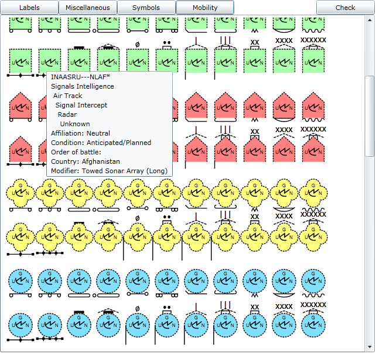\
*Figure 11: Sample mobility, headquarter, task force, feint dummy and
echelon markings*

**Weather Symbols Requiring Altitude or Depth**

Some symbols in Appendix C require either an altitude or a depth value.
The label field X (Altitude/Depth) was chosen to hold this value as a
string representing meters. The following symbols use this value when
plotting:

-   The tropopause low symbol WAS-PLT\-\--P\-\-\-- (parsed as a double
    rounded to the nearest integer for display purposes)

-   The tropopause high symbol WAS-PHT\-\--P\-\-\-- (parsed as a double
    rounded to the nearest integer for display purposes

-   The tropopause level symbol WAS-WST-LVP\-\-\-- (parsed as a double
    rounded to the nearest integer for display purposes

-   The freezing level symbol WAS-WSF-LVP\-\-\-- (parsed as a double
    rounded to the nearest integer for display purposes

-   The soundings symbol WOS-HDS\-\--P\-\-\-- (parsed as the double
    *meters.decimeters* &mdash; only the first digit after the decimal point
    is displayed)

See the Appendix C frame in GraphicsTest for examples.

**Tropical Storm System Weather Symbols**

The Miscellany frame in GraphicsTest includes examples of the tropical
storm system symbols WAS-WSTSD-P\-\-\--, WAS-WSTSS-P\-\-\-- and
WAS-WSTSH-P\-\-\--.\
\
These symbols must be render-able in red (current), purple (future), or
black (past) &mdash; this is accomplished by using the fill and line brushes
that are available as optional arguments to MilSymbol (if the brushes
are null then the default value red is used).\
\
Additionally, the storm fins for these symbols must reverse direction
when in the southern hemisphere &mdash; this is accomplished by placing a
negative sign on the MilSymbol scale parameter (this will left-to-right
reverse any symbol).

**Wind Weather Symbols**

The package uses the label field AA to support cloud cover for the wind
symbols WAS-WC\-\-\--P\-\-\-- and WAS-WP\-\-\--P\-\-\--. Field AA was
chosen because it represents content for the symbol's interior. Using
the integer values (0-8) in this field represents cloud obscuration in
1/8's with| 0 |representing a clear sky and 8 representing an overcast
sky. An additional value of 9 represents an obscured sky.\
\
The wind plot symbol WAS-WP\-\-\--P\-\-\-- requires additional fields to
support wind speed, wind direction, and hemisphere.

-   The label field Z (Speed) is used to represent a double value as the
    wind speed in knots. This is a null-able value so its absence is
    detected as "no report" and a barb is displayed with no wind speed.

-   The label field Q (Direction of Movement Indicator) is used to
    represent a double value as the wind direction, measured clockwise
    in degrees from true north. If this value is not present or is
    invalid, no wind barb will be plotted.

-   The label field Y (Location) is used to represent the southern or
    northern hemisphere via the values N (northern hemisphere) and S
    (southern hemisphere). The northern hemisphere is the default if
    this field is not present.

See the Miscellany frame in GraphicsTest for examples.

**Binding Test**

The binding test illustrates how one can use the dependency properties
of the MilSymbol class to bind an ObservableCollection of business
objects to a Panel (a Canvas in this case) as MilSymbols. Through the
use of this binding, the plot is manipulated simply by changing the
business data that is bound to the display. A feature of this approach
is that simply adding or removing entities from the ObservableCollection
will result in those entities being added or removed from the canvas.\
The example binding is defined in the MainPage.xaml for this sample and
looks something like this:
```XML
<UserControl.Resources>
    <local:DoubleConverter x:Key="DoubleConverter"/>
    <local:Symbols x:Key="SymbolItemsSource" />
    <DataTemplate x:Key="SymbolItemTemplate">
        <MilSym:MilSymbol
        ToolTipService.ToolTip="{Binding Name}"
        SymbolCode="{Binding SymbolCode}"
        Angle="{Binding AngleDegrees}"
        Canvas.Top="{Binding Position.Y}"
        Canvas.Left="{Binding Position.X}"
        LabelH="{Binding AngleDegrees,Converter={StaticResource DoubleConverter}}"
        Scale="0.14"
        />
    </DataTemplate>
</UserControl.Resources>
```
LabelH is generated by converting the double angle value into a string,
including a degree mark.\
The example uses a Canvas as the Panel. A Bing map layer also derives
from Panel. The only thing that would change for the Bing map would be
that the Canvas.Top and Canvas.Left values would be replaced by
something like the following where m: is the map reference and Position
is a Location (or use a value converter to generate a Location object).
```XML
<UserControl.Resources>
    <DataTemplate x:Key="SymbolItemTemplate">
        <MilSym:MilSymbol
        m:MapLayer.MapPosition="{Binding Position}"
        m:MapLayer.MapPositionMethod="Center"
        />
    </DataTemplate>
</UserControl.Resources>
```
The actual collection of business objects is attached inside the XAML
for the Canvas as follows:
```XML
<Canvas
  local:BindStuff.ItemsSource="{Binding Items, Source={StaticResource SymbolItemsSource}}"
  local:BindStuff.ItemTemplate="{StaticResource SymbolItemTemplate}"
/>
```
Basically what this says is that we have a business object referred to
by the key SymbolItemsSource, which in this case is the class Symbols,
and that Symbols has a collection called Items that is to be bound to
the Canvas using the DataTemplate known by the key SymbolItemTemplate.\
MilSymbol's SymbolCode is especially nice for bindings because it is
shorthand for a significant number of properties. Combining that with
MilSymbol's LabelString for creating or modifying multiple labels
simultaneously helps provide an efficient update mechanism.\
\
The boilerplate binding code for this example (BindStuff.cs) is due to
Michael S. Scherotter at Microsoft. The transition of the Bing map from
CTP to release may obviate the need for this particular approach.\

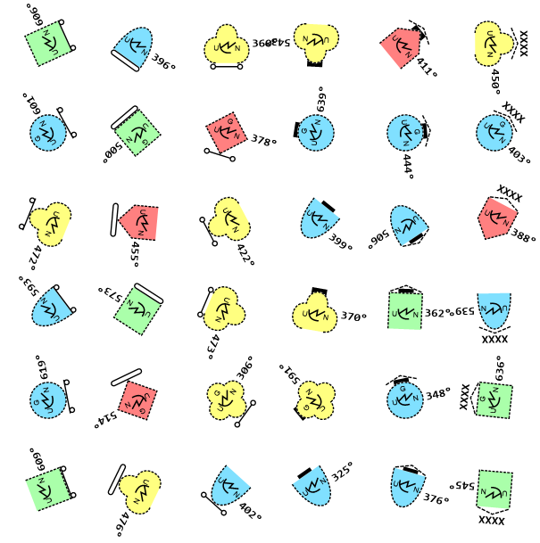\
*Figure 12: Sample bound collection of symbols*

**MapTest**

MapTest (Figure 2) illustrates some initial two- and three-point tactical graphics
symbology as well as bounding boxes for single point symbology. 

The tactical graphics can also be drawn with their
backing vector(s). The red (or purple) vectors represent the original anchor points
while the blue (or orange) vectors represent the transformed vectors supporting that
particular tactical graphic based on an interpretation of the standard.\
\
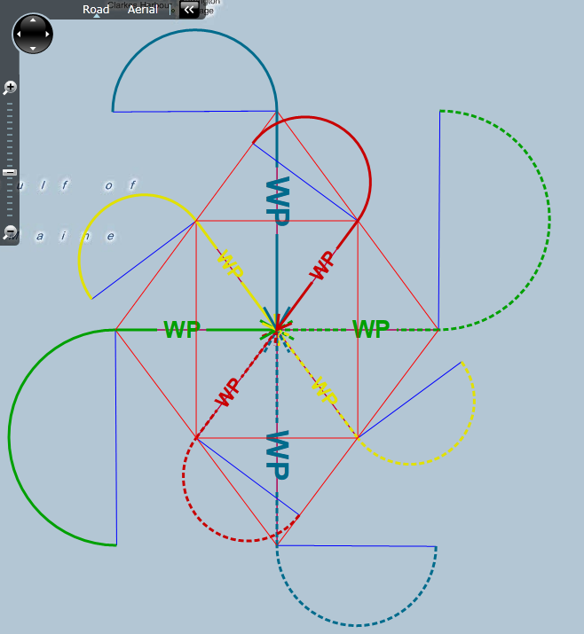\
*Figure 13: Sample three point tactical graphic
(G\*TPWP\-\-\--\*\*\*\*X) using the MilGraphic interface, showing anchor point vectors*

**MilSymUnitTest**

The MilSymUnitTest does not illustrate any particular features of the
project. It exercises a number of class methods using the Silverlight
unit test framework.

**Appendix B Status**

This first table is a list of the symbol codes from Appendix B that
don\'t need to be implemented because there is no symbol associated with
them.

  Page Number | Number Points | Symbol Code       | Description
  ----- |---| ------------------------------------| ---------------------
   328  | 0 |  G\*\-\-\-\-\-\-\-\-\-\-\--X  | Tactical Graphics
   328  | 0 |  G\*T\*\-\-\-\-\--\*\*\*\*X  |  Tasks
  352  | 0 |  G-T\*U\-\-\-\-\-\-\-\--X |    Security
  359  | 0 |  G\*G\*\-\-\-\-\--\*\*\*\*X |  Command and Control and General Maneuver
  359  | 0 |  G\*G\*G\-\-\-\--\*\*\*\*X   |   General
  360  | 0 |  G\*G\*GP\-\-\--\*\*\*\*X |    Points
  360  | 0 |  G\*G\*GPU\-\--\*\*\*\*X |     Under Sea Warfare
  360  | 0 |  G\*G\*GPUU\--\*\*\*\*X |      Underwater
  391  | 0 |  G\*G\*GPW\-\--\*\*\*\*X |     Weapon
  464  | 0 |  G\*G\*GL\-\-\--\*\*\*\*X |    Lines
  470  | 0 |  G\*G\*GA\-\-\--\*\*\*\*X |    Areas
  481  | 0 |  G\*G\*A\-\-\-\--\*\*\*\*X |   Aviation
  481  | 0 |  G\*G\*AP\-\-\--\*\*\*\*X |    Points
  485  | 0 |  G\*G\*AL\-\-\--\*\*\*\*X |    Lines
  490  | 0 |  G\*G\*AA\-\-\--\*\*\*\*X |    Areas
  497  | 0 |  G\*G\*P\-\-\-\--\*\*\*\*X |   Deception
  504  | 0 |  G\*G\*D\-\-\-\--\*\*\*\*X |   Defense
  504  | 0 |  G\*G\*DP\-\-\--\*\*\*\*X |    Points
  511  | 0 |  G\*G\*DL\-\-\--\*\*\*\*X |    Lines
  513  | 0 |  G\*G\*DA\-\-\--\*\*\*\*X |    Areas
  515  | 0 |  G\*G\*O\-\-\-\--\*\*\*\*X |   Offense
  516  | 0 |  G\*G\*OP\-\-\--\*\*\*\*X |    Points
  516  | 0 |  G\*G\*OL\-\-\--\*\*\*\*X |    Lines
  517  | 0 |  G\*G\*OLA\-\--\*\*\*\*X |     Axis of Advance
  520  | 0 |  G\*G\*OLAG\--\*\*\*\*X |      Ground
  522  | 0 |  G\*G\*OLK\-\--\*\*\*\*X |     Direction of Attack
  523  | 0 |  G\*G\*OLKG\--\*\*\*\*X |      Ground
  531  | 0 |  G\*G\*OA\-\-\--\*\*\*\*X |    Areas
  537  | 0 |  G\*G\*S\-\-\-\--\*\*\*\*X |   Special
  537  | 0 |  G\*G\*SL\-\-\--\*\*\*\*X |    Line
  541  | 0 |  G\*G\*SA\-\-\--\*\*\*\*X |    Area
  545  | 0 |  G\*M\*\-\-\-\-\--\*\*\*\*X |  Mobility/survivability
  545  | 0 |  G\*M\*O\-\-\-\--\*\*\*\*X |   Obstacles
  546  | 0 |  G\*M\*OG\-\-\--\*\*\*\*X |    General
  552  | 0 |  G\*M\*OA\-\-\--\*\*\*\*X |    Antitank Obstacles
  552  | 0 |  G\*M\*OAD\-\--\*\*\*\*X |     Antitank Ditch
  555  | 0 |  G\*M\*OAO\-\--\*\*\*\*X |     Antitank Obstacles: Tetrahedrons, <br> Dragons Teeth, and Other Similar Obstacles
  560  | 0 |  G\*M\*OM\-\-\--\*\*\*\*X |    Mines
  566  | 0 |  G\*M\*OF\-\-\--\*\*\*\*X |    Minefields
  572  | 0 |  G\*M\*OE\-\-\--\*\*\*\*X |    Obstacle Effect
  577  | 0 |  G\*M\*OR\-\-\--\*\*\*\*X |    Roadblocks, Craters, and Blown Bridges
  582  | 0 |  G\*M\*OW\-\-\--\*\*\*\*X |    Wire Obstacle
  588  | 0 |  G\*M\*OWC\-\--\*\*\*\*X |     Concertina
  591  | 0 |  G\*M\*OH\-\-\--\*\*\*\*X |    Aviation
  591  | 0 |  G\*M\*OHT\-\--\*\*\*\*X |     Tower
  595  | 0 |  G\*M\*B\-\-\-\--\*\*\*\*X |   Obstacle Bypass
  595  | 0 |  G\*M\*BD\-\-\--\*\*\*\*X |    Obstacle Bypass Difficulty
  598  | 0 |  G\*M\*BC\-\-\--\*\*\*\*X |    Crossing Site/water Crossing
  606  | 0 |  G\*M\*S\-\-\-\--\*\*\*\*X |   Survivability
  613  | 0 |  G\*M\*N\-\-\-\--\*\*\*\*X |   Chemical, Biological, Radiological, and Nuclear
  619  | 0 |  G\*M\*NE\-\-\--\*\*\*\*X |    Release Events
  621  | 0 |  G\*M\*ND\-\-\--\*\*\*\*X |    Decontamination (DECON) Points
  628  | 0 |  G\*F\*\-\-\-\-\--\*\*\*\*X |  Fire Support
  629  | 0 |  G\*F\*P\-\-\-\--\*\*\*\*X |   Point
  629  | 0 |  G\*F\*PT\-\-\--\*\*\*\*X |    Target
  631  | 0 |  G\*F\*PC\-\-\--\*\*\*\*X |    Command & Control Points
  637  | 0 |  G\*F\*L\-\-\-\--\*\*\*\*X |   Lines
  640  | 0 |  G\*F\*LC\-\-\--\*\*\*\*X |    Command & Control Lines
  645  | 0 |  G\*F\*A\-\-\-\--\*\*\*\*X |   Areas
  651  | 0 |  G\*F\*AC\-\-\--\*\*\*\*X |    Command & Control Areas
  651  | 0 |  G\*F\*ACS\-\--\*\*\*\*X |     Fire Support Area (FSA)
  654  | 0 |  G\*F\*ACA\-\--\*\*\*\*X |     Airspace Coordination Area (ACA)
  657  | 0 |  G\*F\*ACF\-\--\*\*\*\*X |     Free Fire Area (FFA)
  660  | 0 |  G\*F\*ACN\-\--\*\*\*\*X |     No-fire Area (NFA)
  663  | 0 |  G\*F\*ACR\-\--\*\*\*\*X |     Restrictive Fire Area (RFA)
  666  | 0 |  G\*F\*ACP\-\--\*\*\*\*X |     Position Area for Artillery (PAA)
  668  | 0 |  G\*F\*ACE\-\--\*\*\*\*X |     Sensor Zone
  671  | 0 |  G\*F\*ACD\-\--\*\*\*\*X |     Dead Space Area (DA)
  674  | 0 |  G\*F\*ACZ\-\--\*\*\*\*X |     Zone of Responsibility (ZOR)
  677  | 0 |  G\*F\*ACB\-\--\*\*\*\*X |     Target Build-up Area (TBA)
  680  | 0 |  G\*F\*ACV\-\--\*\*\*\*X |     Target Value Area (TVAR)
  684  | 0 |  G\*F\*AZ\-\-\--\*\*\*\*X |    Target Acquisition Zones
  684  | 0 |  G\*F\*AZI\-\--\*\*\*\*X |     Artillery Target Intelligence (ATI) Zone
  686  | 0 |  G\*F\*AZX\-\--\*\*\*\*X |     Call for Fire Zone (CFFZ)
  688  | 0 |  G\*F\*AZC\-\--\*\*\*\*X |     Censor Zone
  690  | 0 |  G\*F\*AZF\-\--\*\*\*\*X |     Critical Friendly Zone (CFZ)
  691  | 0 |  G\*F\*AX\-\-\--\*\*\*\*X |    Weapon/Sensor Range Fans
  694  | 0 |  G\*F\*AK\-\-\--\*\*\*\*X |    Kill Box
  694  | 0 |  G\*F\*AKB\-\--\*\*\*\*X |     Blue Kill Box (BKB)
  697  | 0 |  G\*F\*AKP\-\--\*\*\*\*X |     Purple Kill Box (PKB)
  700  | 0 |  G\*S\*\-\-\-\-\--\*\*\*\*X |  Combat Service Support
  700  | 0 |  G\*S\*P\-\-\-\--\*\*\*\*X |   Points
  713  | 0 |  G\*S\*PS\-\-\--\*\*\*\*X |    Supply Points
  724  | 0 |  G\*S\*PA\-\-\--\*\*\*\*X |    Ammunition Points
  726  | 0 |  G\*S\*L\-\-\-\--\*\*\*\*X |   Lines
  727  | 0 |  G\*S\*LC\-\-\--\*\*\*\*X |    Convoys
  728  | 0 |  G\*S\*LR\-\-\--\*\*\*\*X |    Supply Routes
  733  | 0 |  G\*S\*A\-\-\-\--\*\*\*\*X |   Area
  737  | 0 |  G\*S\*AS\-\-\--\*\*\*\*X |    Support Areas
  740  | 0 |  G\*O\*\-\-\-\-\--\*\*\*\*X |  Other
  740  | 0 |  G\*O\*E\-\-\-\--\*\*\*\*X |   Emergency
  743  | 0 |  G\*O\*H\-\-\-\--\*\*\*\*X |   Hazard
  747  | 0 |  G\*O\*S\-\-\-\--\*\*\*\*X |   Sea Subsurface Returns
  759  | 0 |  G\*O\*F\-\-\-\--\*\*\*\*X |   Fix

This second table is a list of the symbol codes from Appendix B that
haven\'t been implemented yet or that are not fully implemented. These
symbols are not being worked.

  Page Number | Number Points | Symbol Code | Description
  ----- |---| -----------------------------| ---------------------
  348 | 4 |   G\*T\*R\-\-\-\--\*\*\*\*X | Relief In Place (RIP)
  352 | 3-4 | G\*T\*US\-\-\--\*\*\*\*X |  Screen
  353 | 3-4 | G\*T\*UG\-\-\--\*\*\*\*X |  Guard
  355 | 3-4 | G\*T\*UC\-\-\--\*\*\*\*X |  Cover
  356 | 3-4 | G\*T\*Z\-\-\-\--\*\*\*\*X | Seize
  467 | 2-N | G\*G\*GLC\-\--\*\*\*\*X |   Line of Contact
  479 | 3-N | G\*G\*GAY\-\--\*\*\*\*X |   Limited Access Area
  480 | 3-N | G\*G\*GAZ\-\--\*\*\*\*X |   Airfield Zone
  485 | 2-N | G\*G\*ALC\-\--\*\*\*\*X |   Air Corridor
  486 | 2-N | G\*G\*ALM\-\--\*\*\*\*X |   Minimum Risk Route (MRR)
  487 | 2-N | G\*G\*ALS\-\--\*\*\*\*X |   Standard-Use Army Aircraft Flight Route (SAAFR)
  488 | 2-N | G\*G\*ALU\-\--\*\*\*\*X |   Unmanned Aircraft (UA) Route
  489 | 2-N | G\*G\*ALL\-\--\*\*\*\*X |   Low Level Transit Route (LLTR)
  500 | 3-N | G\*G\*PM\-\-\--\*\*\*\*X |  Decoy Mined Area
  501 | 3-N | G\*G\*PY\-\-\--\*\*\*\*X |  Decoy Mined Area, Fenced
  503 | 3-N | G\*G\*PC\-\-\--\*\*\*\*X |  Dummy Minefield (dynamic)
  512 | 3 |   G\*G\*DLP\-\--\*\*\*\*X |   Principal Direction of Fire (PDF)
  513 | 3-N | G\*G\*DAB\-\--\*\*\*\*X |   Battle Position
  514 | 3-N | G\*G\*DABP\--\*\*\*\*X |    Prepared but not Occupied
  515 | 3-N | G\*G\*DAE\-\--\*\*\*\*X |   Engagement Area
  518 | 3-N | G\*G\*OLAA\--\*\*\*\*X |    Airborne
  534 | 4 |   G\*G\*OAS\-\--\*\*\*\*X |   Support by Fire Position
  542 | 3-N | G\*G\*SAA\-\--\*\*\*\*X |   Airhead
  543 | 3-N | G\*G\*SAE\-\--\*\*\*\*X |   Encirclement
  567 | 1 |   G\*M\*OFS\-\--\*\*\*\*X |   Static Depiction
  569 | 3-N | G\*M\*OFD\-\--\*\*\*\*X |   Dynamic Depiction
  570 | 4 |   G\*M\*OFG\-\--\*\*\*\*X |   Gap
  571 | 3-N | G\*M\*OFA\-\--\*\*\*\*X |   Mined Area
  576 | 3-N | G\*M\*OU\-\-\--\*\*\*\*X |  Unexploded Ordnance Area (UXO)
  582 | 2-N | G\*M\*OWU\-\--\*\*\*\*X |   Unspecified
  583 | 2-N | G\*M\*OWS\-\--\*\*\*\*X |   Single Fence
  584 | 2-N | G\*M\*OWD\-\--\*\*\*\*X |   Double Fence
  585 | 2-N | G\*M\*OWA\-\--\*\*\*\*X |   Double Apron Fence
  586 | 2-N | G\*M\*OWL\-\--\*\*\*\*X |   Low Wire Fence
  587 | 2-N | G\*M\*OWH\-\--\*\*\*\*X |   High Wire Fence
  588 | 2-N | G\*M\*OWCS\--\*\*\*\*X |    Single Concertina
  589 | 2-N | G\*M\*OWCD\--\*\*\*\*X |    Double Strand Concertina
  590 | 2-N | G\*M\*OWCT\--\*\*\*\*X |    Triple Strand Concertina
  593 | 2-N | G\*M\*OHO\-\--\*\*\*\*X |   Overhead Wire/power Line
  598 | 4 |   G\*M\*BCA\-\--\*\*\*\*X |   Assault Crossing Area
  599 | 4 |   G\*M\*BCB\-\--\*\*\*\*X |   Bridge or Gap
  608 | 2 |   G\*M\*SL\-\-\--\*\*\*\*X |  Fortified Line
  610 | 3-N | G\*M\*SP\-\-\--\*\*\*\*X |  Strong Point
  613 | 3 |   G\*M\*NM\-\-\--\*\*\*\*X |  Minimum Safe Distance Zones
  616 | 3-N | G\*M\*NR\-\-\--\*\*\*\*X |  Radioactive Area
  617 | 3-N | G\*M\*NB\-\-\--\*\*\*\*X |  Biologically Contaminated Area
  618 | 3-N | G\*M\*NC\-\-\--\*\*\*\*X |  Chemically Contaminated Area
  628 | 3-N | G\*M\*NL\-\-\--\*\*\*\*X |  Dose Rate Contour Lines
  640 | 2-N | G\*F\*LCF\-\--\*\*\*\*X |   Fire Support Coordination Line (FSCL)
  641 | 2-N | G\*F\*LCC\-\--\*\*\*\*X |   Coordinated Fire Line (CFL)
  642 | 2-N | G\*F\*LCN\-\--\*\*\*\*X |   No-fire Line (NFL)
  643 | 2-N | G\*F\*LCR\-\--\*\*\*\*X |   Restrictive Fire Line (RFL)
  644 | 2-N | G\*F\*LCM\-\--\*\*\*\*X |   Munition Flight Path (MFP)
  646 | 1 |   G\*F\*ATR\-\--\*\*\*\*X |   Rectangular Target
  647 | 1 |   G\*F\*ATC\-\--\*\*\*\*X |   Circular Target
  648 | 3-N | G\*F\*ATG\-\--\*\*\*\*X |   Series Or Group of Targets
  651 | 3-N | G\*F\*ACSI\--\*\*\*\*X |    Fire Support Area (FSA), Irregular
  652 | 2 |   G\*F\*ACSR\--\*\*\*\*X |    Fire Support Area (FSA), Rectangular
  653 | 1 |   G\*F\*ACSC\--\*\*\*\*X |    Fire Support Area (FSA), Circular
  654 | 3-N | G\*F\*ACAI\--\*\*\*\*X |    Airspace Coordination Area (ACA), Irregular
  655 | 2 |   G\*F\*ACAR\--\*\*\*\*X |    Airspace Coordination Area (ACA), Rectangular
  656 | 1 |   G\*F\*ACAC\--\*\*\*\*X |    Airspace Coordination Area (ACA), Circular
  657 | 3-N | G\*F\*ACFI\--\*\*\*\*X |    Free Fire Area (FFA), Irregular
  658 | 2 |   G\*F\*ACFR\--\*\*\*\*X |    Free Fire Area (FFA), Rectangular
  659 | 1 |   G\*F\*ACFC\--\*\*\*\*X |    Free Fire Area (FFA), Circular
  660 | 3-N | G\*F\*ACNI\--\*\*\*\*X |    No Fire Area (NFA), Irregular
  661 | 2 |   G\*F\*ACNR\--\*\*\*\*X |    No Fire Area (NFA), Rectangular
  662 | 1 |   G\*F\*ACNC\--\*\*\*\*X |    No Fire Area (NFA), Circular
  663 | 3-N | G\*F\*ACRI\--\*\*\*\*X |    Restrictive Fire Area (RFA), Irregular
  664 | 2 |   G\*F\*ACRR\--\*\*\*\*X |    Restrictive Fire Area (RFA), Rectangular
  665 | 1 |   G\*F\*ACRC\--\*\*\*\*X |    Restrictive Fire Area (RFA), Circular
  666 | 2 |   G\*F\*ACPR\--\*\*\*\*X |    Position Area for Artillery (PAA), Rectangular
  667 | 1 |   G\*F\*ACPC\--\*\*\*\*X |    Position Area for Artillery (PAA), Circular
  668 | 3-N | G\*F\*ACEI\--\*\*\*\*X |    Sensor Zone, Irregular
  669 | 2 |   G\*F\*ACER\--\*\*\*\*X |    Sensor Zone, Rectangular
  670 | 1 |   G\*F\*ACEC\--\*\*\*\*X |    Sensor Zone, Circular
  671 | 3-N | G\*F\*ACDI\--\*\*\*\*X |    Dead Space Area (DA), Irregular
  672 | 2 |   G\*F\*ACDR\--\*\*\*\*X |    Dead Space Area (DA), Rectangular
  673 | 1 |   G\*F\*ACDC\--\*\*\*\*X |    Dead Space Area (DA), Circular
  674 | 3-N | G\*F\*ACZI\--\*\*\*\*X |    Zone of Responsibility (ZOR), Irregular
  675 | 2 |   G\*F\*ACZR\--\*\*\*\*X |    Zone of Responsibility (ZORzor), Rectangular
  676 | 1 |   G\*F\*ACZC\--\*\*\*\*X |    Zone of Responsibility (ZOR), Circular
  677 | 3-N | G\*F\*ACBI\--\*\*\*\*X |    Target Build Up Area (TBA), Irregular
  678 | 2 |   G\*F\*ACBR\--\*\*\*\*X |    Target Build Up Area (TBA), Rectangular
  679 | 1 |   G\*F\*ACBC\--\*\*\*\*X |    Target Build Up Area (TBA), Circular
  680 | 3-N | G\*F\*ACVI\--\*\*\*\*X |    Target Value Area (TVAR), Irregular
  681 | 2 |   G\*F\*ACVR\--\*\*\*\*X |    Target Value Area (TVAR), Rectangular
  682 | 1 |   G\*F\*ACVC\--\*\*\*\*X |    Target Value Area (TVAR), Circular
  683 | 3-N | G\*F\*ACT\-\--\*\*\*\*X |   Terminally Guided Munition Footprint (TGMF)
  684 | 3-N | G\*F\*AZII\--\*\*\*\*X |    Artillery Target Intelligence (ATI) Zone, Irregular
  685 | 2 |   G\*F\*AZIR\--\*\*\*\*X |    Artillery Target Intelligence (ATI) Zone, Rectangular
  686 | 3-N | G\*F\*AZXI\--\*\*\*\*X |    Call for Fire Zone (CFFZ), Irregular
  687 | 2 |   G\*F\*AZXR\--\*\*\*\*X |    Call for Fire Zone (CFFZ), Rectangular
  688 | 3-N | G\*F\*AZCI\--\*\*\*\*X |    Censor Zone, Irregular
  689 | 2 |   G\*F\*AZCR\--\*\*\*\*X |    Censor Zone, Rectangular
  690 | 3-N | G\*F\*AZFI\--\*\*\*\*X |    Critical Friendly Zone (CFZ), Irregular
  691 | 2 |   G\*F\*AZFR\--\*\*\*\*X |    Critical Friendly Zone (CFZ), Rectangular
  692 | 1 |   G\*F\*AXC\-\--\*\*\*\*X |   Weapon/Sensor Range Fan, Circular
  693 | 1 |   G\*F\*AXS\-\--\*\*\*\*X |   Weapon/Sensor Range Fan, Sector
  694 | 1 |   G\*F\*AKBC\--\*\*\*\*X |    Blue Kill Box, Circular
  695 | 3-N | G\*F\*AKBI\--\*\*\*\*X |    Blue Kill Box, Irregular
  696 | 2 |   G\*F\*AKBR\--\*\*\*\*X |    Blue Kill Box, Rectangular
  697 | 1 |   G\*F\*AKPC\--\*\*\*\*X |    Purple Kill Box, Circular
  698 | 3-N | G\*F\*AKPI\--\*\*\*\*X |    Purple Kill Box, Irregular
  699 | 2 |   G\*F\*AKPR\--\*\*\*\*X |    Purple Kill Box, Rectangular
  726 | 2 |   G\*S\*LCM\-\--\*\*\*\*X |   Moving Convoy
  727 | 2 |   G\*S\*LCH\-\--\*\*\*\*X |   Halted Convoy
  728 | 2 |   G\*S\*LRM\-\--\*\*\*\*X |   Main Supply Route
  729 | 2 |   G\*S\*LRA\-\--\*\*\*\*X |   Alternate Supply Route
  730 | 2 |   G\*S\*LRO\-\--\*\*\*\*X |   One-way Traffic
  731 | 2 |   G\*S\*LRT\-\--\*\*\*\*X |   Alternating Traffic
  732 | 2 |   G\*S\*LRW\-\--\*\*\*\*X |   Two-way Traffic
  733 | 3-N | G\*S\*AD\-\-\--\*\*\*\*X |  Detainee Holding Area
  734 | 3-N | G\*S\*AE\-\-\--\*\*\*\*X |  Enemy Prisoner of War (EPW) Holding Area
  735 | 3-N | G\*S\*AR\-\-\--\*\*\*\*X |  Forward Arming and Refueling Area (FARP)
  736 | 3-N | G\*S\*AH\-\-\--\*\*\*\*X |  Refugee Holding Area
  737 | 3-N | G\*S\*ASB\-\--\*\*\*\*X |   Brigade (BSA)
  738 | 3-N | G\*S\*ASD\-\--\*\*\*\*X |   Division (DSA)
  739 | 3-N | G\*S\*ASR\-\--\*\*\*\*X |   Regimental (RSA)

This third table is a list of the symbol codes from Appendix B that have
been fully implemented.

  Page Number | Number Points | Symbol Code | Description
  ----|---|-----------------------------|---------------------
  329 | 3 |   G\*T\*B\-\-\-\--\*\*\*\*X | Block
  330 | 3 |   G\*T\*H\-\-\-\--\*\*\*\*X | Breach
  331 | 3 |   G\*T\*Y\-\-\-\--\*\*\*\*X | Bypass
  332 | 3 |   G\*T\*C\-\-\-\--\*\*\*\*X | Canalize
  333 | 3 |   G\*T\*X\-\-\-\--\*\*\*\*X | Clear
  334 | 3 |   G\*T\*J\-\-\-\--\*\*\*\*X | Contain
  335 | N |   G\*T\*K\-\-\-\--\*\*\*\*X | Counterattack (CATK)
  336 | N |   G\*T\*KF\-\-\--\*\*\*\*X |  Counterattack by Fire
  337 | 3 |   G\*T\*L\-\-\-\--\*\*\*\*X | Delay
  338 | 1 |   G\*T\*D\-\-\-\--\*\*\*\*X | Destroy
  339 | 3 |   G\*T\*T\-\-\-\--\*\*\*\*X | Disrupt
  340 | 2 |   G\*T\*F\-\-\-\--\*\*\*\*X | Fix
  341 | 2 |   G\*T\*A\-\-\-\--\*\*\*\*X | Follow and Assume
  342 | 2 |   G\*T\*AS\-\-\--\*\*\*\*X |  Follow and Support
  343 | 1 |   G\*T\*I\-\-\-\--\*\*\*\*X | Interdict
  344 | 2 |   G\*T\*E\-\-\-\--\*\*\*\*X | Isolate
  345 | 1 |   G\*T\*N\-\-\-\--\*\*\*\*X | Neutralize
  346 | 2 |   G\*T\*O\-\-\-\--\*\*\*\*X | Occupy
  347 | 3 |   G\*T\*P\-\-\-\--\*\*\*\*X | Penetrate
  349 | 2 |   G\*T\*Q\-\-\-\--\*\*\*\*X | Retain
  350 | 3 |   G\*T\*M\-\-\-\--\*\*\*\*X | Retirement
  351 | 2 |   G\*T\*S\-\-\-\--\*\*\*\*X | Secure
  358 | 3 |   G\*T\*W\-\-\-\--\*\*\*\*X | Withdraw
  359 | 3 |   G\*T\*WP\-\-\--\*\*\*\*X |  Withdraw Under Pressure
  361 | 1 |   G\*G\*GPUUD-\*\*\*\*X |     Datum
  362 | 1 |   G\*G\*GPUUB-\*\*\*\*X |     Brief Contact
  363 | 1 |   G\*G\*GPUUL-\*\*\*\*X |     Lost Contact
  364 | 1 |   G\*G\*GPUUS-\*\*\*\*X |     Sinker
  365 | 1 |   G\*G\*GPUY\--\*\*\*\*X |    Sonobuoy
  366 | 1 |   G\*G\*GPUYP-\*\*\*\*X |     Pattern Center
  367 | 1 |   G\*G\*GPUYD-\*\*\*\*X |     Directional Frequency Analyzing and Recording (DIFAR)
  368 | 1 |   G\*G\*GPUYL-\*\*\*\*X |     Low Frequency Analyzing and Recording (LOFAR)
  369 | 1 |   G\*G\*GPUYC-\*\*\*\*X |     Command Active Sonobuoy System (CASS)
  370 | 1 |   G\*G\*GPUYS-\*\*\*\*X |     Directional Command Active Sonobuoy System (DICASS)
  371 | 1 |   G\*G\*GPUYB-\*\*\*\*X |     Bathythermograph Transmitting (BT)
  372 | 1 |   G\*G\*GPUYA-\*\*\*\*X |     ANM
  373 | 1 |   G\*G\*GPUYV-\*\*\*\*X |     Vertical Line Array DIFAR (VLAD)
  374 | 1 |   G\*G\*GPUYT-\*\*\*\*X |     ATAC
  375 | 1 |   G\*G\*GPUYR-\*\*\*\*X |     Range Only (RO)
  376 | 1 |   G\*G\*GPUYK-\*\*\*\*X |     Kingpin
  377 | 1 |   G\*G\*GPUYX-\*\*\*\*\*   |   Sonobuoy-expired
  378 | 1 |   G\*G\*GPUS\--\*\*\*\*X |    Search
  379 | 1 |   G\*G\*GPUSA-\*\*\*\*X |     Search Area
  380 | 1 |   G\*G\*GPUSD-\*\*\*\*X |     Dip Position
  381 | 1 |   G\*G\*GPUSC-\*\*\*\*X |     Search Center
  382 | 1 |   G\*G\*GPR\-\--\*\*\*\*X |   Reference Point
  383 | 1 |   G\*G\*GPRN\--\*\*\*\*X |    Navigational Reference Point
  384 | 1 |   G\*G\*GPRS\--\*\*\*\*X |    Special Point
  385 | 1 |   G\*G\*GPRD\--\*\*\*\*X |    DLRP
  386 | 1 |   G\*G\*GPRP\--\*\*\*\*X |    Point of Intended Movement (PIM)
  387 | 1 |   G\*G\*GPRM\--\*\*\*\*X |    Marshall Point
  388 | 1 |   G\*G\*GPRW\--\*\*\*\*X |    Waypoint
  389 | 1 |   G\*G\*GPRC\--\*\*\*\*X |    Corridor Tab
  390 | 1 |   G\*G\*GPRI\--\*\*\*\*X |    Point of Interest
  391 | 1 |   G\*G\*GPWA\--\*\*\*\*X |    Aim Point
  392 | 1 |   G\*G\*GPWD\--\*\*\*\*X |    Drop Point
  393 | 1 |   G\*G\*GPWE\--\*\*\*\*X |    Entry Point
  394 | 1 |   G\*G\*GPWG\--\*\*\*\*X |    Ground Zero
  395 | 1 |   G\*G\*GPWM\--\*\*\*\*X |    Msl Detect Point
  396 | 1 |   G\*G\*GPWI\--\*\*\*\*X |    Impact Point
  397 | 1 |   G\*G\*GPWP\--\*\*\*\*X |    Predicted Impact Point
  398 | 1 |   G\*G\*GPF\-\--\*\*\*\*X |   Formation
  399 | 1 |   G\*G\*GPH\-\--\*\*\*\*X |   Harbor (general)
  400 | 1 |   G\*G\*GPHQ\--\*\*\*\*X |    Point Q
  401 | 1 |   G\*G\*GPHA\--\*\*\*\*X |    Point A
  402 | 1 |   G\*G\*GPHY\--\*\*\*\*X |    Point Y
  403 | 1 |   G\*G\*GPHX\--\*\*\*\*X |    Point X
  404 | 1 |   G\*G\*GPO\-\--\*\*\*\*X |   Route
  405 | 1 |   G\*G\*GPOZ\--\*\*\*\*X |    Rendezvous
  406 | 1 |   G\*G\*GPOD\--\*\*\*\*X |    Diversions
  407 | 1 |   G\*G\*GPOW\--\*\*\*\*X |    Waypoint
  408 | 1 |   G\*G\*GPOP\--\*\*\*\*X |    PIM
  409 | 1 |   G\*G\*GPOR\--\*\*\*\*X |    Point R
  410 | 1 |   G\*G\*GPA\-\--\*\*\*\*X |   Air Control
  411 | 1 |   G\*G\*GPAP\--\*\*\*\*X |    Combat Air Patrol (CAP)
  412 | 1 |   G\*G\*GPAW\--\*\*\*\*X |    Airborne Early Warning (AEW)
  413 | 1 |   G\*G\*GPAK\--\*\*\*\*X |    Tanking
  414 | 1 |   G\*G\*GPAA\--\*\*\*\*X |    Antisubmarine Warfare, Fixed Wing
  415 | 1 |   G\*G\*GPAH\--\*\*\*\*X |    Antisubmarine Warfare, Rotary Wing
  416 | 1 |   G\*G\*GPAB\--\*\*\*\*X |    Sucap - Fixed Wing
  417 | 1 |   G\*G\*GPAC\--\*\*\*\*X |    Sucap - Rotary Wing
  418 | 1 |   G\*G\*GPAD\--\*\*\*\*X |    Miw - Fixed Wing
  419 | 1 |   G\*G\*GPAE\--\*\*\*\*X |    Miw - Rotary Wing
  420 | 1 |   G\*G\*GPAS\--\*\*\*\*X |    Strike IP
  421 | 1 |   G\*G\*GPAT\--\*\*\*\*X |    Tacan
  422 | 1 |   G\*G\*GPAO\--\*\*\*\*X |    Tomcat
  423 | 1 |   G\*G\*GPAR\--\*\*\*\*X |    Rescue
  424 | 1 |   G\*G\*GPAL\--\*\*\*\*X |    Replenish
  425 | 1 |   G\*G\*GPAF\--\*\*\*\*X |    Unmanned Aerial System (UAS/UA)
  426 | 1 |   G\*G\*GPAG\--\*\*\*\*X |    Vtua
  427 | 1 |   G\*G\*GPAI\--\*\*\*\*X |    Orbit
  428 | 1 |   G\*G\*GPAJ\--\*\*\*\*X |    Orbit - Figure Eight
  429 | 1 |   G\*G\*GPAM\--\*\*\*\*X |    Orbit - Race Track
  430 | 1 |   G\*G\*GPAN\--\*\*\*\*X |    Orbit - Random, Closed
  431 | 1 |   G\*G\*GPP\-\--\*\*\*\*X |   Action Points (general)
  432 | 1 |   G\*G\*GPPK\--\*\*\*\*X |    Check Point
  433 | 1 |   G\*G\*GPPC\--\*\*\*\*X |    Contact Point
  434 | 1 |   G\*G\*GPPO\--\*\*\*\*X |    Coordination Point
  435 | 1 |   G\*G\*GPPD\--\*\*\*\*X |    Decision Point
  436 | 1 |   G\*G\*GPPL\--\*\*\*\*X |    Linkup Point
  437 | 1 |   G\*G\*GPPP\--\*\*\*\*X |    Passage Point
  438 | 1 |   G\*G\*GPPR\--\*\*\*\*X |    Rally Point
  439 | 1 |   G\*G\*GPPE\--\*\*\*\*X |    Release Point
  440 | 1 |   G\*G\*GPPS\--\*\*\*\*X |    Start Point
  441 | 1 |   G\*G\*GPPA\--\*\*\*\*X |    Amnesty Point
  442 | 1 |   G\*G\*GPPW\--\*\*\*\*X |    Waypoint
  443 | 1 |   G\*G\*GPC\-\--\*\*\*\*X |   Sea Surface Control Station
  444 | 1 |   G\*G\*GPCU\--\*\*\*\*X |    Unmanned Surface Vehicle (USV) Control Station
  445 | 1 |   G\*G\*GPCUR-\*\*\*\*X |     Remote Multimission Vehicle (RMV) USV Control Station
  446 | 1 |   G\*G\*GPCUA-\*\*\*\*X |     USV - Antisubmarine Warfare Control Station
  447 | 1 |   G\*G\*GPCUS-\*\*\*\*X |     USV - Surface Warfare Control Station
  448 | 1 |   G\*G\*GPCUM-\*\*\*\*X |     USV - Mine Warfare Control Station
  449 | 1 |   G\*G\*GPCA\--\*\*\*\*X |    ASW Control Station
  450 | 1 |   G\*G\*GPCS\--\*\*\*\*X |    SUW Control Station
  451 | 1 |   G\*G\*GPCM\--\*\*\*\*X |    MIW Control Station
  452 | 1 |   G\*G\*GPCP\--\*\*\*\*X |    Picket Control Station
  453 | 1 |   G\*G\*GPCR\--\*\*\*\*X |    Rendezvous Control Point
  454 | 1 |   G\*G\*GPCC\--\*\*\*\*X |    Rescue Control Point
  455 | 1 |   G\*G\*GPCE\--\*\*\*\*X |    Replenishment Control Point
  456 | 1 |   G\*G\*GPCN\--\*\*\*\*X |    Noncombatant Control Station
  457 | 1 |   G\*G\*GPB\-\--\*\*\*\*X |   Subsurface Control Station
  458 | 1 |   G\*G\*GPBU\--\*\*\*\*X |    Unmanned Underwater Vehicle (UUV) Control Station
  459 | 1 |   G\*G\*GPBUA-\*\*\*\*X |     UUV - Antisubmarine Warfare Control Station
  460 | 1 |   G\*G\*GPBUS-\*\*\*\*X |     UUV - Surface Warfare Control Station
  461 | 1 |   G\*G\*GPBUM-\*\*\*\*X |     UUV - Mine Warfare Control Station
  462 | 1 |   G\*G\*GPBS\--\*\*\*\*X |    Submarine Control Station
  463 | 1 |   G\*G\*GPBSA-\*\*\*\*X |     ASW Submarine Control Station
  464 | 2-N | G\*G\*GLB\-\--\*\*\*\*X |   Boundaries
  466 | 2-N | G\*G\*GLF\-\--\*\*\*\*X |   Forward Line of Own Troops (FLOT)
  468 | 2-N | G\*G\*GLP\-\--\*\*\*\*X |   Phase Line
  469 | 2-N | G\*G\*GLL\-\--\*\*\*\*X |   Light Line
  470 | 3-N | G\*G\*GAG\-\--\*\*\*\*X |   General Area
  471 | 3-N | G\*G\*GAA\-\--\*\*\*\*X |   Assembly Area
  472 | 3-N | G\*G\*GAE\-\--\*\*\*\*X |   Engagement Area
  473 | 3-N | G\*G\*GAF\-\--\*\*\*\*X |   Fortified Area
  474 | 3-N | G\*G\*GAD\-\--\*\*\*\*X |   Drop Zone
  475 | 3-N | G\*G\*GAX\-\--\*\*\*\*X |   Extraction Zone (EZ)
  476 | 3-N | G\*G\*GAL\-\--\*\*\*\*X |   Landing Zone (LZ)
  477 | 3-N | G\*G\*GAP\-\--\*\*\*\*X |   Pickup Zone (PZ)
  478 | 3 |   G\*G\*GAS\-\--\*\*\*\*X |   Search Area/reconnaissance Area
  481 | 1 |   G\*G\*APP\-\--\*\*\*\*X |   Air Control Point (ACP)
  482 | 1 |   G\*G\*APC\-\--\*\*\*\*X |   Communications Checkpoint (CCP)
  483 | 1 |   G\*G\*APU\-\--\*\*\*\*X |   Pull-up Point (PUP)
  484 | 1 |   G\*G\*APD\-\--\*\*\*\*X |   Downed Aircrew Pickup Point
  490 | 3-N | G\*G\*AAR\-\--\*\*\*\*X |   Restricted Operations Zone (ROZ)
  491 | 3-N | G\*G\*AAF\-\--\*\*\*\*X |   Short-range Air Defense Engagement Zone (SHORADEZ)
  492 | 3-N | G\*G\*AAH\-\--\*\*\*\*X |   High Density Airspace Control Zone (HIDACZ)
  493 | 3-N | G\*G\*AAM\-\--\*\*\*\*X |   Missile Engagement Zone (MEZ)
  494 | 3-N | G\*G\*AAML\--\*\*\*\*X |    Low Altitude MEZ
  495 | 3-N | G\*G\*AAMH\--\*\*\*\*X |    High Altitude MEZ
  496 | 3-N | G\*G\*AAW\-\--\*\*\*\*X |   Weapons Free Zone
  497 | 3 |   G\*G\*PD\-\-\--\*\*\*\*X |  Dummy (deception/decoy)
  498 | 3-N | G\*G\*PA\-\-\--\*\*\*\*X |  Axis of Advance for Feint
  499 | 2 |   G\*G\*PF\-\-\--\*\*\*\*X |  Direction of Attack for Feint
  502 | 1 |   G\*G\*PN\-\-\--\*\*\*\*X |  Dummy Minefield (static)
  504 | 1 |   G\*G\*DPT\-\--\*\*\*\*X |   Target Reference Point (TRP)
  505 | 1 |   G\*G\*DPO\-\--\*\*\*\*X |   Observation Post/Outpost
  506 | 1 |   G\*G\*DPOC\--\*\*\*\*X |    Combat Outpost
  507 | 1 |   G\*G\*DPOR\--\*\*\*\*X |    Observation Post Occupied by Dismounted<br>Scouts or Reconnaissance
  508 | 1 |   G\*G\*DPOF\--\*\*\*\*X |    Forward Observer Position
  509 | 1 |   G\*G\*DPOS\--\*\*\*\*X |    Sensor Outpost/Listening Post (OP/LP)
  510 | 1 |   G\*G\*DPON\--\*\*\*\*X |    CBRN Observation Post (dismounted)
  511 | 2 |   G\*G\*DLF\-\--\*\*\*\*X |   Forward Edge of Battle Area (FEBA)
  516 | 1 |   G\*G\*OPP\-\--\*\*\*\*X |   Point of Departure
  517 | 3-N | G\*G\*OLAV\--\*\*\*\*X |    Aviation
  519 | 3-N | G\*G\*OLAR\--\*\*\*\*X |    Attack, Rotary Wing
  520 | 3-N | G\*G\*OLAGM-\*\*\*\*X |     Main Attack
  521 | 3-N | G\*G\*OLAGS-\*\*\*\*X |     Supporting Attack
  522 | 2 |   G\*G\*OLKA\--\*\*\*\*X |    Aviation
  523 | 2 |   G\*G\*OLKGM-\*\*\*\*X |     Main Attack
  522 | 2 |   G\*G\*OLKGS-\*\*\*\*X |     Supporting Attack
  525 | 2-N | G\*G\*OLF\-\--\*\*\*\*X |   Final Coordination Line
  526 | 3 |   G\*G\*OLI\-\--\*\*\*\*X |   Infiltration Lane
  527 | 2-N | G\*G\*OLL\-\--\*\*\*\*X |   Limit of Advance
  528 | 2-N | G\*G\*OLT\-\--\*\*\*\*X |   Line of Departure
  529 | 2-N | G\*G\*OLC\-\--\*\*\*\*X |   Line of Departure/line of Contact (LD/LC)
  530 | 2-N | G\*G\*OLP\-\--\*\*\*\*X |   Probable Line of Deployment (PLD)
  531 | 3-N | G\*G\*OAA\-\--\*\*\*\*X |   Assault Position
  532 | 3-N | G\*G\*OAK\-\--\*\*\*\*X |   Attack Position
  533 | 3 |   G\*G\*OAF\-\--\*\*\*\*X |   Attack by Fire Position
  535 | 3-N | G\*G\*OAO\-\--\*\*\*\*X |   Objective
  536 | 3-N | G\*G\*OAP\-\--\*\*\*\*X |   Penetration Box
  537 | 3 |   G\*G\*SLA\-\--\*\*\*\*X |   Ambush
  538 | 3-N | G\*G\*SLH\-\--\*\*\*\*X |   Holding Line
  539 | 2-N | G\*G\*SLR\-\--\*\*\*\*X |   Release Line
  540 | 3-N | G\*G\*SLB\-\--\*\*\*\*X |   Bridgehead
  541 | 3-N | G\*G\*SAO\-\--\*\*\*\*X |   Area of Operations (AO)
  544 | 3-N | G\*G\*SAN\-\--\*\*\*\*X |   Named Area of Interest (NAI)
  545 | 3-N | G\*G\*SAT\-\--\*\*\*\*X |   Targeted Area of Interest (TAI)
  546 | 3-N | G\*M\*OGB\-\--\*\*\*\*X |   Belt
  547 | 2-N | G\*M\*OGL\-\--\*\*\*\*X |   Line
  548 | 3-N | G\*M\*OGZ\-\--\*\*\*\*X |   Zone
  549 | 3-N | G\*M\*OGF\-\--\*\*\*\*X |   Obstacle Free Area
  550 | 3-N | G\*M\*OGR\-\--\*\*\*\*X |   Obstacle Restricted Area
  551 | 2 |   G\*M\*OS\-\-\--\*\*\*\*X |  Abatis
  552 | 2-N | G\*M\*OADU\--\*\*\*\*X |    Under Construction
  553 | 2-N | G\*M\*OADC\--\*\*\*\*X |    Complete
  554 | 2-N | G\*M\*OAR\-\--\*\*\*\*X |   Antitank Ditch Reinforced with Antitank Mines
  555 | 1 |   G\*M\*OAOF\--\*\*\*\*X |    Fixed and Prefabricated
  556 | 1 |   G\*M\*OAOM\--\*\*\*\*X |    Moveable
  557 | 1 |   G\*M\*OAOP\--\*\*\*\*X |    Moveable and Prefabricated
  558 | 2-N | G\*M\*OAW\-\--\*\*\*\*X |   Antitank Wall
  559 | 1 |   G\*M\*OB\-\-\--\*\*\*\*X |  Booby Trap
  560 | 1 |   G\*M\*OMU\-\--\*\*\*\*X |   Unspecified Mine
  561 | 1 |   G\*M\*OMT\-\--\*\*\*\*X |   Antitank Mine (AT)
  562 | 1 |   G\*M\*OMD\-\--\*\*\*\*X |   Antitank Mine with Antihandling Device
  563 | 1 |   G\*M\*OME\-\--\*\*\*\*X |   Antitank Mine (directional)
  564 | 1 |   G\*M\*OMP\-\--\*\*\*\*X |   Antipersonnel (AP) Mines
  565 | 1 |   G\*M\*OMW\-\--\*\*\*\*X |   Wide Area Mines
  566 | 2 |   G\*M\*OMC\-\--\*\*\*\*X |   Mine Cluster
  572 | 3 |   G\*M\*OEB\-\--\*\*\*\*X |   Block
  573 | 2 |   G\*M\*OEF\-\--\*\*\*\*X |   Fix
  574 | 3 |   G\*M\*OET\-\--\*\*\*\*X |   Turn
  575 | 3 |   G\*M\*OED\-\--\*\*\*\*X |   Disrupt
  577 | 3 |   G\*M\*ORP\-\--\*\*\*\*X |   Planned
  578 | 3 |   G\*M\*ORS\-\--\*\*\*\*X |   Explosives, State of Readiness - 1 (safe)
  579 | 3 |   G\*M\*ORA\-\--\*\*\*\*X |   Explosives, State of Readiness - 2 (armed-but passable)
  580 | 3 |   G\*M\*ORC\-\--\*\*\*\*X |   Roadblock Complete (executed)
  581 | 3 |   G\*M\*OT\-\-\--\*\*\*\*X |  Trip Wire
  591 | 1 |   G\*M\*OHTL\--\*\*\*\*X |    Low
  592 | 1 |   G\*M\*OHTH\--\*\*\*\*X |    High
  595 | 3 |   G\*M\*BDE\-\--\*\*\*\*X |   Bypass Easy
  596 | 3 |   G\*M\*BDD\-\--\*\*\*\*X |   Bypass Difficult
  597 | 3 |   G\*M\*BDI\-\--\*\*\*\*X |   Bypass Impossible
  600 | 2 |   G\*M\*BCF\-\--\*\*\*\*X |   Ferry
  601 | 3 |   G\*M\*BCE\-\--\*\*\*\*X |   Ford Easy
  602 | 3 |   G\*M\*BCD\-\--\*\*\*\*X |   Ford Difficult
  603 | 2 |   G\*M\*BCL\-\--\*\*\*\*X |   Lane
  604 | 2 |   G\*M\*BCR\-\--\*\*\*\*X |   Raft Site
  605 | 1 |   G\*M\*BCP\-\--\*\*\*\*X |   Engineer Regulating Point
  606 | 1 |   G\*M\*SE\-\-\--\*\*\*\*X |  Earthwork, Small Trench or Fortification
  607 | 1 |   G\*M\*SF\-\-\--\*\*\*\*X |  Fort
  609 | 2 |   G\*M\*SW\-\-\--\*\*\*\*X |  Foxhole, Emplacement or Weapon Site
  611 | 1 |   G\*M\*SS\-\-\--\*\*\*\*X |  Surface Shelter
  612 | 1 |   G\*M\*SU\-\-\--\*\*\*\*X |  Underground Shelter
  614 | 1 |   G\*M\*NZ\-\-\--\*\*\*\*X |  Nuclear Detonations Ground Zero
  615 | 1 |   G\*M\*NF\-\-\--\*\*\*\*X |  Fallout Producing
  619 | 1 |   G\*M\*NEB\-\--\*\*\*\*X |   Biological
  620 | 1 |   G\*M\*NEC\-\--\*\*\*\*X |   Chemical
  621 | 1 |   G\*M\*NDP\-\--\*\*\*\*X |   Decon Site/point (Unspecified)
  622 | 1 |   G\*M\*NDA\-\--\*\*\*\*X |   Alternate Decon Site/point (Unspecified)
  623 | 1 |   G\*M\*NDT\-\--\*\*\*\*X |   Decon Site/point (Troops)
  624 | 1 |   G\*M\*NDE\-\--\*\*\*\*X |   Decon Site/point (Equipment)
  625 | 1 |   G\*M\*NDB\-\--\*\*\*\*X |   Decon Site/point (Equipment and Troops)
  626 | 1 |   G\*M\*NDO\-\--\*\*\*\*X |   Decon Site/point (Operational Decontamination)
  627 | 1 |   G\*M\*NDD\-\--\*\*\*\*X |   Decon Site/point (Thorough Decontamination)
  629 | 1 |   G\*F\*PTS\-\--\*\*\*\*X |   Point/Single Target
  630 | 1 |   G\*F\*PTN\-\--\*\*\*\*X |   Nuclear Target
  631 | 1 |   G\*F\*PCF\-\--\*\*\*\*X |   Fire Support Station
  632 | 1 |   G\*F\*PCS\-\--\*\*\*\*X |   Survey Control Point
  633 | 1 |   G\*F\*PCB\-\--\*\*\*\*X |   Firing Point
  634 | 1 |   G\*F\*PCR\-\--\*\*\*\*X |   Reload Point
  635 | 1 |   G\*F\*PCH\-\--\*\*\*\*X |   Hide Point
  636 | 1 |   G\*F\*PCL\-\--\*\*\*\*X |   Launch Point
  637 | 2 |   G\*F\*LT\-\-\--\*\*\*\*X |  Linear Target
  638 | 2 |   G\*F\*LTS\-\--\*\*\*\*X |   Linear Smoke Target
  639 | 2 |   G\*F\*LTF\-\--\*\*\*\*X |   Final Protective Fire (FPF)
  645 | 3-N | G\*F\*AT\-\-\--\*\*\*\*X |  Area Target
  649 | 3-N | G\*F\*ATS\-\--\*\*\*\*X |   Smoke
  650 | 3-N | G\*F\*ATB\-\--\*\*\*\*X |   Bomb Area
  700 | 1 |   G\*S\*PX\-\-\--\*\*\*\*X |  Ambulance Exchange Point
  701 | 1 |   G\*S\*PC\-\-\--\*\*\*\*X |  Cannibalization Point
  702 | 1 |   G\*S\*PY\-\-\--\*\*\*\*X |  Casualty Collection Point
  703 | 1 |   G\*S\*PT\-\-\--\*\*\*\*X |  Civilian Collection Point
  704 | 1 |   G\*S\*PD\-\-\--\*\*\*\*X |  Detainee Collection Point
  705 | 1 |   G\*S\*PE\-\-\--\*\*\*\*X |  Enemy Prisoner of War (EPW) Collection Point
  706 | 1 |   G\*S\*PL\-\-\--\*\*\*\*X |  Logistics Release Point (LRP)
  707 | 1 |   G\*S\*PM\-\-\--\*\*\*\*X |  Maintenance Collection Point
  708 | 1 |   G\*S\*PR\-\-\--\*\*\*\*X |  Rearm, Refuel and Resupply Point
  709 | 1 |   G\*S\*PU\-\-\--\*\*\*\*X |  Refuel on the Move (ROM) Point
  710 | 1 |   G\*S\*PO\-\-\--\*\*\*\*X |  Traffic Control Post (TCP)
  711 | 1 |   G\*S\*PI\-\-\--\*\*\*\*X |  Trailer Transfer Point
  712 | 1 |   G\*S\*PN\-\-\--\*\*\*\*X |  Unit Maintenance Collection Point
  713 | 1 |   G\*S\*PSZ\-\--\*\*\*\*X |   General
  714 | 1 |   G\*S\*PSA\-\--\*\*\*\*X |   Class I
  715 | 1 |   G\*S\*PSB\-\--\*\*\*\*X |   Class II
  716 | 1 |   G\*S\*PSC\-\--\*\*\*\*X |   Class III
  717 | 1 |   G\*S\*PSD\-\--\*\*\*\*X |   Class IV
  718 | 1 |   G\*S\*PSE\-\--\*\*\*\*X |   Class V
  719 | 1 |   G\*S\*PSF\-\--\*\*\*\*X |   Class VI
  720 | 1 |   G\*S\*PSG\-\--\*\*\*\*X |   Class VII
  721 | 1 |   G\*S\*PSH\-\--\*\*\*\*X |   Class VIII
  722 | 1 |   G\*S\*PSI\-\--\*\*\*\*X |   Class IX
  723 | 1 |   G\*S\*PSJ\-\--\*\*\*\*X |   Class X
  724 | 1 |   G\*S\*PAS\-\--\*\*\*\*X |   Ammunition Supply Point (ASP)
  725 | 1 |   G\*S\*PAT\-\--\*\*\*\*X |   Ammunition Transfer Point (ATP)
  740 | 1 |   G\*O\*ED\-\-\--\*\*\*\*X |  Ditched Aircraft
  741 | 1 |   G\*O\*EP\-\-\--\*\*\*\*X |  Person in Water
  742 | 1 |   G\*O\*EV\-\-\--\*\*\*\*X |  Distressed Vessel
  743 | 1 |   G\*O\*HM\-\-\--\*\*\*\*X |  Sea Mine-like
  744 | 2 |   G\*O\*HN\-\-\--\*\*\*\*X |  Navigational
  745 | 1 |   G\*O\*HI\-\-\--\*\*\*\*X |  Iceberg
  746 | 1 |   G\*O\*HO\-\-\--\*\*\*\*X |  Oil Rig
  747 | 1 |   G\*O\*SB\-\-\--\*\*\*\*X |  Bottom Return/Non-MILCO
  748 | 1 |   G\*O\*SBM\-\--\*\*\*\*X |   Installation/Manmade
  749 | 1 |   G\*O\*SBN\-\--\*\*\*\*X |   Seabed Rock/Stone, Obstacle, Other
  750 | 1 |   G\*O\*SBW\-\--\*\*\*\*X |   Wreck, Non Dangerous
  751 | 1 |   G\*O\*SBX\-\--\*\*\*\*X |   Wreck, Dangerous
  752 | 1 |   G\*O\*SM\-\-\--\*\*\*\*X |  Marine Life
  753 | 1 |   G\*O\*SS\-\-\--\*\*\*\*X |  Sea Anomaly (Wake, Current, Knuckle)
  754 | 2 |   G\*O\*B\-\-\-\--\*\*\*\*X | Bearing Line
  755 | 2 |   G\*O\*BE\-\-\--\*\*\*\*X |  Electronic
  756 | 2 |   G\*O\*BA\-\-\--\*\*\*\*X |  Acoustic
  757 | 2 |   G\*O\*BT\-\-\--\*\*\*\*X |  Torpedo
  758 | 2 |   G\*O\*BO\-\-\--\*\*\*\*X |  Electro-optical Intercept
  759 | 1 |   G\*O\*FA\-\-\--\*\*\*\*X |  Acoustic
  760 | 1 |   G\*O\*FE\-\-\--\*\*\*\*X |  Electro-magnetic
  761 | 1 |   G\*O\*FO\-\-\--\*\*\*\*X |  Electro-optical

 
